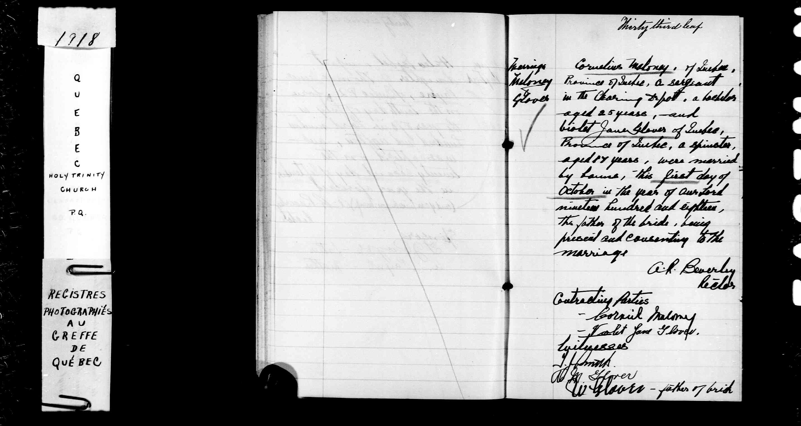
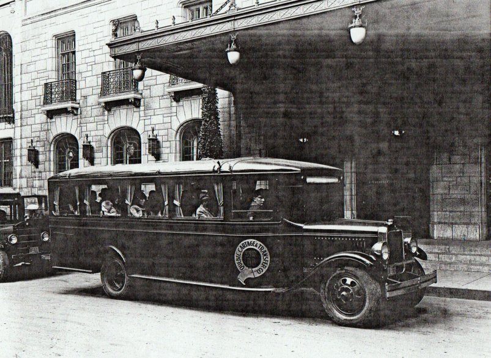
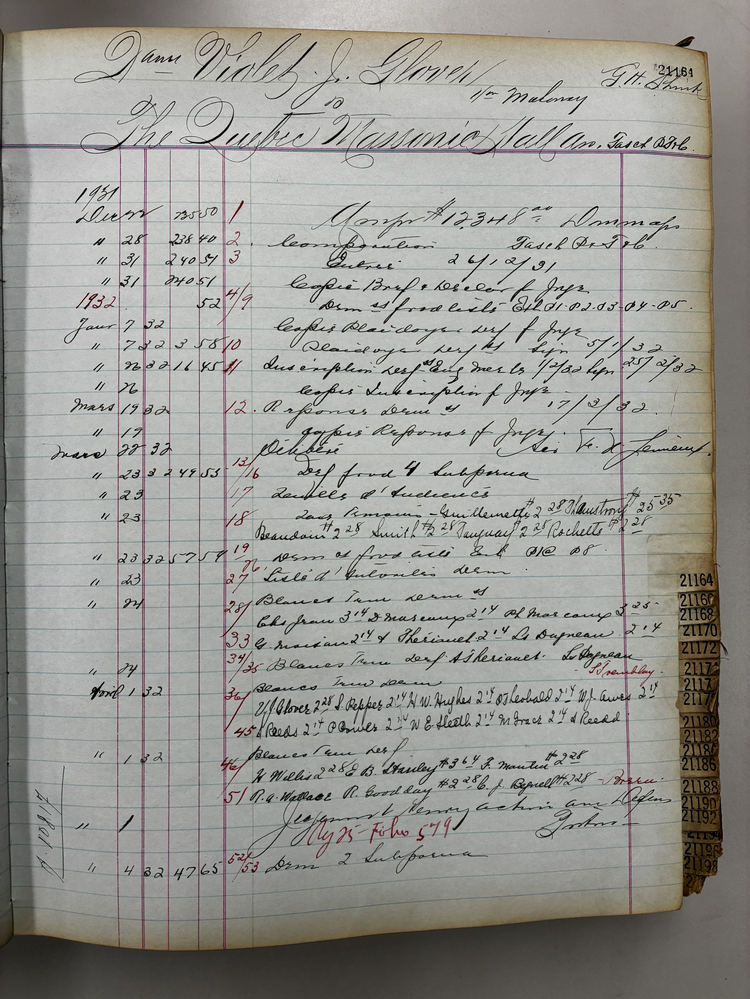
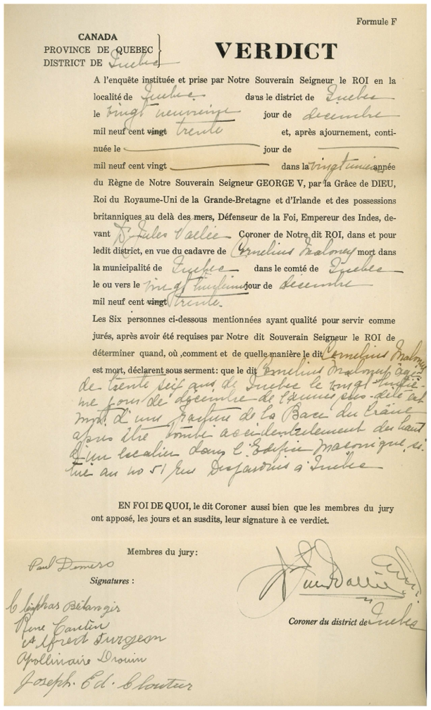
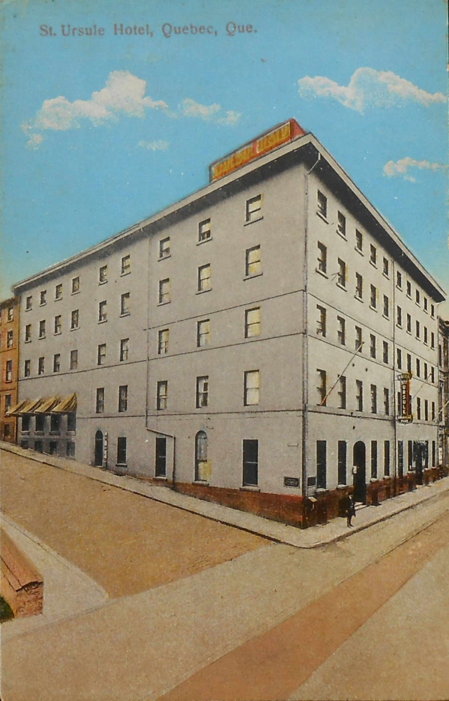
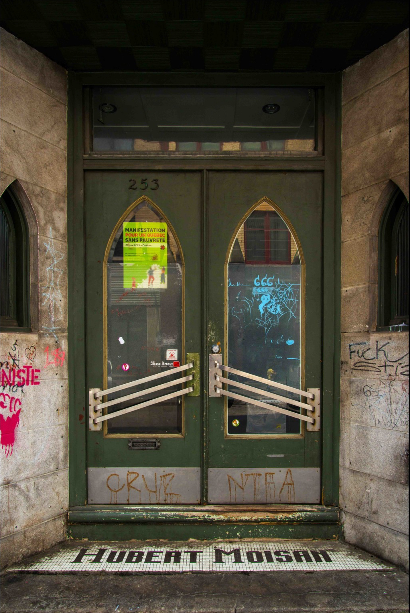

# Cornelius Maloney (1893/10/02-1930/12/28)

## Identification

Nom de famille: Maloney   
Prénom: Cornelius   
Initiale: C   
Sexe: M   
Langue: English    
Réligion: Catholique Romain   
Date de naissance: 2 octobre 1893   
Ville natale: Glasgow   
Pays d'origine: Scotland    
Date d'arrivée au Canada: 1903     
Nom du père: William Maloney   
Nom de la mère: Agnes Campbell   


### Renseignements additionnels 

Weight: 135 lbs   
Height: 5'4"  
Complexion: Fair   
Colour of eyes: Brown   
Hair: L Brown   

no vaccine    
scar over left eye   
mole between shoulders   

## Première Guerre

### Situation personnelle avant son enrôlement Première Guerre 

Résidence: Calgary   
Province: AB   
Métier: Chauffeur   
État matrimonial: single   
Prénom et nom de famille de la conjointe: nil   
Nombre d'enfants: nil   

### Enrôlement 

Date: 3 sept 1914   
Age: 21    
Lieu enrôlement: Valcartier, Québec   
Province: QC   
Matricule: 33406   
Grade: Private  
Force: Armée   
A servi pour: Canada   
Régiment: 3rd Field Ambulance   
Division: CAMC (Canadian Army Medical Corps)   
Batailles ou opérations: Ypres (1916).  
Honneurs: nil.  
Discharge: 15 jan 1919.  

### Service Files de la Grande Guerre 

[Service File WWI](https://recherche-collection-search.bac-lac.gc.ca/eng/Home/Record?app=pffww&IdNumber=172190&ecopy=478937a)

War Diary blessure Pte Maloney: 3rd Canadian Field Ambulance - Private, June 1916, p.3    
https://canadiangreatwarproject.com/diaries/viewer.php?u=3rd_canadian_field_ambulance&m=06&y=1916&i=e001498088

Complet War Diaries:     
https://recherche-collection-search.bac-lac.gc.ca/eng/home/record?idnumber=2005066&app=FonAndCol&ecopy=e001497916

Now and then: Trench journal de la 3rd Field Ambulance.    
https://www.canadiana.ca/view/oocihm.8_06934_1/7

## Mariage

Épouse: Violet Jane Glover.    
Date du Mariage: 1er oct 1918.   
Local mariage: Holy Trinity.    Cathedral, Quebec City, QC.    
Confession: Anglicaine



## Occupation 

Quebec Carthage & Transfer Company.    
https://www.histoireautobusquebec.com/quebec-cartage/

https://web.archive.org/web/20170225170721/http://histoireautobusquebec.com/index.php?option=com_content&view=article&id=136:quebec-cartage&catid=16:cie-operateurs&Itemid=34




## Décès

Date du decès: 28 déc 1930   
Âge: 36   
Cause du décès: chute accidentelle    
Endroit du décès: QMHA building, Québec   
Pays du décès: Canada   

## Inhumation

Pays: Canada   
Province: Quebec   
Cimitière: Mount Hermon Cemetery, Sillery, Quebec City    
Sépulture: Section H, lot 11587    
Date d'inhumation: 31 décembre 1930    

Inscriptions: 

CORNELIUS MALONEY    
AGE 36   
DIED DECEMBER 28TH 1930    
DADDY   

HE WHO BELIEVETH IN ME   
SHALL NEVER DIE     
JOHN 11,25

Base de donnés en généalogie    
Recherche avancée - Le registre d’inhumation du Mount Hermon Cemetery, 1848-1950 (Mise à jour 5 janvier 2023)

https://www2.banq.qc.ca/archives/genealogie_histoire_familiale/ressources/bd/recherche.html?id=HERMON_20170823&2=maloney&3=&5=&6=&8=&9=&10=&11=&12=&13=&14=&15=&17=

```
Détails

    Family name / Nom : Maloney
    Given name / Prénom : Cornelius
    Gender / Sexe : M.
    Occupation / Profession : Carriage agent
    Place of birth / Lieu de naissance : Scotland
    Age / Âge : 36 years
    Place of death / Lieu du décès : Quebec
    Date of death / Date du décès : 1930-12-28
    Disease or cause of death / Cause du décès (1848-1938) : Fracture of the skull (accidental)
    Where buried / Lieu d'inhumation : H-S.G.
    Date of interment / Date d'inhumation : 1930-12-31
    Religious denomination / Religion : Church of England
    Officiating clergyman / Célébrant : Rev. Pepperdene
    Date of birth / Date de naissance :
    Church / Église :
    Remarks / Remarques :
```

## Couverture médiatique

**Il fait une chute fatale    
Le soleil, 29 décembre 1930, lundi 29 décembre 1930**   
https://numerique.banq.qc.ca/patrimoine/details/52327/3478841?docsearchtext=cornelius%20maloney

*Cornelius Maloney, 36 ans, se fracture le crâne en tombant du troisième étage de l'édifice de la loge maçonnique de Québec.    
-Sur la rue Des Jardins, samedi.*   

**UNE ENQUETE**

Vers une heure et demie, dans la nuit de samedi à dimanche, est survenu un tragique accident, à la loge maçonnique de la rue Des Jardins. M. Cornelius Maloney, agent de voiture de la Quebec Carthage, a trouvé la mort, par fracture du crâne, à cet endroit, en tombant dans un escalier tournant. Le défunt était âgé de 36 ans et père de deux enfants.   
A la fin d'une réunion générale annuelle des membres de la loge, M. Maloney était monté pour appeler un taxi au troisième étage. A cet étage supérieur et peu fréquenté de la loge maçonnique de la rue Des Jardins, le puits de l'escalier n'est pas protégé par une rampe ou garde-fou. En se détournant, après son appel téléphonique. M. Maloney s'avança trop près du dernier palier de l'escalier et tomba dans le vide.    
Le chauffeur de taxi que M. Maloney avait demandé fut le premier à s'apercevoir de l'accident. Un médecin fut demandé, mais M. Maloney avait succombé. Le constable Alb. Othot et les détectives Oscar Tanguay et Aimé Guillemette ont constaté qu'il s'agissait d'un pur accident. Le cadavre a été transporté à la morgue Hubert Moisan ou le Dr Vallée tiendra une enquête.

----

**Un véredict   
Le soleil, 30 décembre 1930, mardi 30 décembre 1930**   
https://numerique.banq.qc.ca/patrimoine/details/52327/3478843?docsearchtext=cornelius%20maloney


*UN VERDICT*   

Un verdict de mort accidentelle a été rendu par le jury du coroner, dans le cas de M. Cornelius Maloney, qui s'est tué en tombant d'un escalier samedi soir.    
L'enquête a eu lieu hier, sous la présidence du Dr Jules Vallée, coroner du district.

---- 

**Obituary - Cornelius Maloney   
The Calgary Herald, 10 janv 1931**   
https://www.myheritage.com/research/record-12004-5781277/cornelius-maloney-in-canada-obituary-index-from-oldnewscom

*CORNELIUS MALONEY*    

Word has been received by relatives here of the accidental death of Cornelius Maloney, of Quebec, on December 28.     
Calgary relatives include Mrs. A. Maylor, his mother and his stepfather, Mr. Maylor one sister, Mrs. Larry Patrick and a brother, William Maloney. Mr. Maloney was born in Glasgow, Scotland, and has been a resident of Quebec for the past twelve years.

---- 

**La Masonic Association poursuivie   
Le soleil, 23 mars 1932, mercredi 23 mars 1932**   
https://numerique.banq.qc.ca/patrimoine/details/52327/3440384?docsearchtext=Violet%20Glover

*LA MASONIC ASSOCIATION POURSUIVIE*

Une dame de Québec réclame $12,348 de dommages de la Quebec Masonic Hall Association, par suite d'un accident qui a causé la mort de son mari. - Autres causes.    
Devant sir François Lemieux, juges-en-chef de la Cour Supérieure s'est instruit, hier le procès de Mme Cornelius Maloney, née Violet Glover, contre la Quebec Masonic Hall Association.    
M. Cornelius Maloney fit une chute mortelle, en descendant un escalier, dans l'édifice de la Masonic Hall Association, rue Des Jardins, le 28 décembre 1930. Il se fractura le crâne et mourut, quelques instants après cet accident. Sa veuve dame Violet Glover, réclame maintenant, tant pour elle-même que pour ses enfants mineurs, des dommages-intérêts, à la loge maçonnique. Le montant de sa réclamation est de $12,348.    
Des témoins ont été longuement interrogés sur l'état de l’escalier, lors de cet accident. Quelques -uns déclarèrent qu'il était alors et qu'il est encore dangereux, à cause de si vétusté. D'autres affirmèrent qu'il n'est aucunement dangereux.    
Une autre question est de savoir si Maloney se trouvait ou non par affaires, dans cet édifice, le soir de ce tragique accident. La poursuite dit que oui. La défense affirme que rien ne légitimait, ce soir-là, la présence de Maloney, dans ce local de la loge St -Jean, dont le défunt était membre. Elle représenta au tribunal que les membres de la loge St-Jean n'ont droit de se trouver, au lieu où l'accident est arrivé, que pour les assemblées régulières de leur loge et elle dit que, ce soir-là, il n'y avait pas de telle assemblée en ce lieu. La poursuite réplique que Maloney était alors là par affaire et que, même dans les appartements semi-privés, le propriétaire est obligé d'effectuer les travaux de réparation et d'entretien requis pour que la vie des gens ne soit pas en danger.     
La cause a été prise en délibéré.

----

**Reclamation de $12,348  Mme Cornelius Maloney, née Violet Glover, poursuit la Quebec Masonic Hall Association pour ce montant   
L'événement, 23 mars 1932, mercredi 23 mars 1932**   
https://numerique.banq.qc.ca/patrimoine/details/52327/4589199?docsearchtext=Violet%20Glover


*Madame Cornelius Maloney, née Violet Glover, poursuit la Quebec Masonic Hall Association pour ce montant.    
ECHO D'UN ACCIDENT*

Plusieurs se souviennent d'un accident survenu le 28 décembre 1930 à la loge maçonnique de la rue Desjardins. M. Cornelius Maloney était tombé en descendant l'escalier et il s'était fracturé le crâne. Sa veuve, dame Violet Glover, prenait dernièrement une action de $12,348 en Cour Supérieure. Elle réclame cette somme de la "Quebec Masonic Hall Association", tant en son nom qu'en celui de ses enfants mineurs dont elle est la tutrice. Le procès s'est instruit hier devant Sir François Lemieux.    
Il s'agit d’abord, dans cette cause, d'une question de faits. La poursuite prétend que l'escalier où M. Maloney est tombé est absolument défectueux.    
Elle prétend que les marches sont usées et très dangereuses tellement elles sont glissantes. La défense contredit cette prétention et fit entendre à cette fin plusieurs témoins. Ces derniers déclarèrent qu'ils passent souvent dans cet escalier et qu'ils ne l'ont jamais trouvé dangereux et que d'ailleurs aucun accident ne s'y est produit avant celui qui fait la base de ce procès.    
La défense soulève de plus un point de droit, à savoir que le défunt n'avait pas d'affaires à se trouver là le jour de l'accident. Maloney faisait partie de la loge St-Jean.    
Celle -ci n'a pas de succursale. Elle tient ses assemblées dans les salles de la rue Desjardins et paye $200 de loyer par an pour cela. En dehors de ces assemblées, les membres de la loge St-Jean ne sont pas supposés aller à ces salles. Or, le jour de l’accident, il n'y avait pas d'assemblée et on prétend que Maloney pouvait se dispenser de se trouver là.    
La poursuite réplique qu'il y allait par affaire et que tout propriétaire est obligé d'entretenir son logis de manière à ce que la vie des gens ne soit pas mise en danger, même s'il s'agit d'établissements semi-privés.    
Cette cause a été prise en délibéré par Sir François Lemieux. Les procureurs des parties sont: pour la demanderesse, Me Georges Shink, et pour les défendeurs, Me Robert Taschereau, C.R.    

----

**Seeks $12000 damages: Québec woman enters suit after husband's death   
The Gazette, 24 mars 1932**     
https://www.proquest.com/docview/2158923521/D5E4DE41FC894601PQ/1?sourcetype=Newspapers

*Quebec Woman Enters Suit After Husband's Death*    

Quebec, March 23 - Mrs. Cornelius Maloney, widow of Corneilus Maloney, who met death by a fall from the stairs in the corridor of the Masonic Hall here in December, 1930, is suing the Quebec Masonic Hall Association for $12,000 as damages for herself and children. The case is being argued before Chief Justice Sir Francois Lemieux in Superior Court here. At the time of Maloney's death, a coroner's jury found that death had been accidental. In her action Mrs. Maloney claims that the condition of the stairway at the time was responsible for the accident. Evidence in the case was concluded today and it was taken en delibéré.

----

**Crime And Legal Affairs   
Fall River Herald News, Mar 28 1932**   
https://www.myheritage.com/research/record-12013-1297406456/cornelius-maloney-in-names-stories-in-newspapers-from-oldnewscom-massachusetts-maine-new-hampshire

Mrs. Cornelius Maloney has brought suit against the Quebec Masonic Hall association to recover $12,000 damages for the death of her husband, who fell over a staircase in the hall about a year ago. Justice Sir Francois Lemieux will preside at the trial.

----

**Charge not sustained: Action is dismissed   
The Gazette, 2 avril 1932**   
https://www.proquest.com/docview/2158660790/D5E4DE41FC894601PQ/2?accountid=8612&sourcetype=Newspapers

*Action Is Dismissed*    

Quebec, April 1.- The action of Mrs. Maloney, widow of Cornelius Maloney, who was claiming $12,000 damages from the Quebec Masonic Hall Association for the death of her husband, who was killed by a fall in the association's building here in December, 1930, was dismissed with costs by Chief Justice Sir Francois Lemieux in Superior Court today.    

---- 

**Jugement de Sir François.  
L'Événement, 2 avril 1932.**  
https://numerique.banq.qc.ca/patrimoine/details/52327/4589208?docsearchtext=cornelius%20maloney

*Sir François Lemieux renvoie l'action, au montant de $20,000, dans la cause de Dame Cornelius Maloney contre la Masonic Hall.    
ECHO D'UN ACCIDENT*    

Sir François Lemieux a rendu jugement, hier, dans la cause de Dame Glover, épouse de feu Cornelius Maloney, contre la Quebec Masonic Hall Association.    
Le 28 décembre 1930, Maloney était tombé en bas d'un escalier, à la loge de la rue Desjardins. Il s'était tué du coup. Sa veuve réclamait $20.000 de dommages, tenant l'Association responsable de cet accident. Elle prétendait, en effet, que son mari était tombé parce que l'escalier n'était pas dans un bon état, que les marches étaient usées et très glissantes.    
Sir François Lemieux déclare, d'après la preuve faite, que cet escalier n'était pas dangereux qu'aucun accident ne s'y est jamais produit et qu'aucune plainte non plus n'a été faite précédemment. D'ailleurs, n'y a aucun témoin direct de l'accident et personne ne sait comment le défunt a pu tomber.    
Lorsqu'on l'a trouvé, ses pardessus n'étaient pas attachés c'est peut-être ce qui a occasionné sa chute.    
L'action de la demanderesse est donc rejetée avec dépens.    


## Procès dommages-intêrets

**Demanderesse:** *Violet Jane Glover (Violet Maloney)*.  
**Défendeur:** *Quebec Masonic Hall Association*.  

**Juge-en-chef:** *Sir François Lemieux*, Cour Supérieure du Québec.  
**Avocats:**    
    *Poursuite:* Me Georges Shink.  
    *Défense  :* Me Robert Taschereau    


Demande dommages de $12 348,00 suite au décès de son époux, Cornelius Maloney,    
à l'intérieur de l'édifice de la Masonic Hall le 28 décembre 1930.  

Instruction du procès: 22/03/1932.  
Fin de la phase d'instruction: 24/03/1932.  
Procès rejeté avec dépens: 02/04/1932.  

Montant de $12 348,00 en mars 1932 est l'equivalent à $279 098,63 en 2026, ajusté par l'inflation de la période.     
Source: Banque du Canada (https://www.banqueducanada.ca/taux/renseignements-complementaires/feuille-de-calcul-de-linflation/).

**AdVitam BAnQ**    
*Plumitif*   
Cote TP11,S1,SS2,SSS7    
Année 1931     
Numéro du procès: 21164



**Plumitif**


## Registres publiques

### Registre Ancestry   
https://www.ancestry.ca/family-tree/person/tree/159702802/person/182710021407/facts


### Enquête du Coroner   
https://www2.banq.qc.ca/archives/genealogie_histoire_familiale/ressources/bd/recherche.html?id=CORONERS_QUEBEC&2=Maloney&3=Cornelius&4=&5=&6=&7=&8=&9=&10=&11=&12=&13=&16=&17=&18=&19=

    Détails

    Nom : Maloney
    Prénom : Cornelius
    Profession - métier :
    Lieu de résidence : Québec (Ville : Québec)
    Âge : 36 ans    
    Parents :
    Date de décès / découverte du corps : 1930-12-28
    Date de l'enquête : 1930-12-29
    Lieu de l'enquête : Québec (Ville : Québec)
    Nom du Coroner : Jules Vallée
    Cause ou circonstances du décès - Verdict du coroner : Mort d'une fracture de la base du crâne après être tombé du haut d'un escalier dans l'édifice maçonnique situé au n° 51 rue Desjardins à Québec
    Présence de témoignages : Oui
    District judiciaire : Québec
    Source : Archives nationales à Québec, TP12,S1,SS26,SSS1 (1960-01-353/2351), Fonds Cour des sessions de la paix, district de Québec
    Numéro de dossier : 573
    Résumé :

**Véredict du Coroner**     



## Dans le creux des colonnes

Questions: 
1. Était-il membre de la loge St.John's?
2. Y-a-t-il eu la St. John's Night le 27/12/1930? À la loge ou ailleurs?
3. Le décès était mentionné dans les PVs des mois suivants - jan, fev, mar, avr 1931?
4. Le procès de la veuve était mentionné dans les PVs des mois qui s'en suivent, avr, mai, sept, oct... 1932?

Answers:
1. Yes, Cornelius Maloney was initiated into the mysteries of Freemasonry on January 21st 1929. Passed? Raised?
2. Yes, there was a Saint John's Night on 1930. However, the regular communication opened the lodge at 11.05 a.m. and closed it at 11.20 a.m. 
3. Yes, on January 19th 1931 communication it was moved to send a letter of condolence to the widow and family and for the lodge to go into mourning for 3 months. Carried.
   On April 20th 1931 communication it was moved by W.Br.W.F.Aves seconded by W.Bro.Rudd that application be made to the Grand Lodge Benevolent Fund for the sum of $300 for the widow and family of our late bro. C. Maloney. Carried. (sum updated by inflation to 2026 $ 6 780,82, Bank of Canada). 
4. No, nothing was stated in any of the minutes of the months that followed March 1932 on the matter of the process for damages moved by Mrs. Maloney. 

New questions: 
1. (from answer 2) On March 16th 1931 there's a financial statement of St John's Day committe... held by day? Was the banquet held by lunch time? Was it at the Lodge's grounds or at a restaurant? 
2. Were there renovations on the stairway after the case?
3. When was the stairway replaced by a lift?
4. How much do lodges pay AMBQ for the use of the temple? Annually? Monthly? 


**Dec 21st, p.47**    
"Read letter from Bro.D. McWilliams, Chairman, St.John's Day Comittee, stating that a banquet would be held on Dec 28th at St.Ursule Hotel, speaker of the evening to be Rev. Bro. A.D. Matheson."


## Autres références 

Service files WWI - Oscar Tanguay: https://recherche-collection-search.bac-lac.gc.ca/eng/home/record?app=pffww&idnumber=267375&ecopy=625513a

Service files WWI - Aimé Guillemette: https://recherche-collection-search.bac-lac.gc.ca/eng/Home/Record?app=pffww&IdNumber=437726&ecopy=B3877-S036

**St Ursule Hotel**  
31-33, rue St-Louis   
Annuaire de la Ville de Québec, 1930-1931, p.132



**Salon Funéraire Hubert Moisan**    
253, rue St-Jean E, Québec   
Annuaire de la Ville de Québec, 1930-1931, p.



*Situation actuelle pénible du bâtiment du Salon Funéraire Hubert Moisan.*

**Biographie Juge-en-chef Sir François Lemieux:**     
https://www.biographi.ca/fr/bio/lemieux_francois_xavier_16F.html

## Documents

### Passenger List

Agnes Campbell and Nellie Maloney.  

Ship: Empress of Britain

Arrival: August 1908

Destination: Calgary

https://recherche-collection-search.bac-lac.gc.ca/eng/Home/Record?app=paslisandborent&IdNumber=1810844&ecopy=e003591747

### Recensement 1916

[Recensement des provinces des prairies (1916)](https://recherche-collection-search.bac-lac.gc.ca/fra/Accueil/Notice?app=census&IdNumber=42383394&ecopy=31228_4363977-00463)


### Homestead Grant

MB, SK and AB Homestead Grant Registers 

|||
|---|----|
|Province|Alberta|
|Aplication year|1919|
|Homestead number|344335|
|Part|NE|
|Section|16|
|Township|32|
|Range|19|
|Meridian|W4|
|Localization|[51°45'02.9"N 112°37'54.5"W](https://maps.app.goo.gl/Nrr6PAprWrrt8xe8A?g_st=ig)|
||51.7508,-112.6318|

Adresse: NE-16-32-19-W4, Starland County, between Delia, Rowley and Big Valley area. 

Ref: [Homestead Index](https://www.abgenealogy.ca/alberta-homestead-index)


